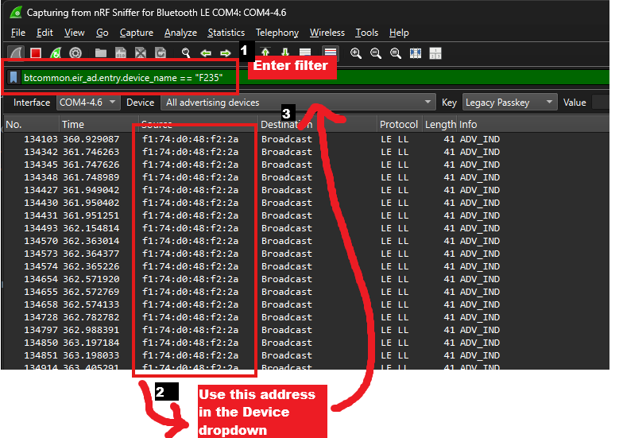
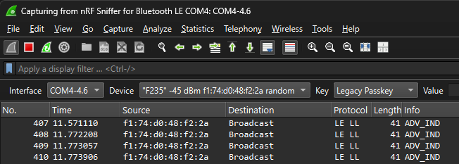

# Sniffing Guide: Nordic Semiconductors

This guide shows how to sniff the device key using a nRF52840 USB dongle on Windows. However it should be applicable to other Nordic Semiconductors devices that support BLE sniffing and should work on any of Windows, macOS or Linux.

## Setting up nRF Util

We first need to install the foundational nRF tooling, and then use that to turn your nRF dongle into a BLE sniffer by flashing its firmware. 

1. Install nRF Util as described in the [official documentation](https://docs.nordicsemi.com/bundle/nrfutil/page/guides/installing.html). Note you will need to also install SEGGER J-Link as described. 
2. Install the nRF Sniffer command as described in the [official documentation](https://docs.nordicsemi.com/bundle/nrfutil/page/nrfutil-ble-sniffer/guides/installing_nrf_sniffer.html).
3. Install and use the nRF Device command to flash your dongle with the sniffer firmware as described in the [official documentation](https://docs.nordicsemi.com/bundle/nrfutil/page/nrfutil-ble-sniffer/guides/programming_firmware.html).

## Settings up Wireshark

As well as ensuring Wireshark has the nRF plugin, we also add my plugin to make capturing the device key extra simple!

1. Install Wireshark ([Windows and MacOS](https://docs.nordicsemi.com/bundle/nrfutil/page/nrfutil-ble-sniffer/guides/installing_wireshark_win_mac.html), [Linux](https://docs.nordicsemi.com/bundle/nrfutil/page/nrfutil-ble-sniffer/guides/installing_wireshark_ubuntu.html)).
2. Install the nRF Util Wireshark plugin by executing the CLI command as described in the [official documentation](https://docs.nordicsemi.com/bundle/nrfutil/page/nrfutil-ble-sniffer/guides/installing_nrf_sniffer_capture_tool.html). You are now ready to start Wireshark.
3. Copy [btatt_boneco_device_key.lua](../../wireshark/btatt_boneco_device_key.lua) from this project and place it into the Wireshark plugin directory (create folder if does not exist):
   * **Windows**: %APPDATA%\Wireshark\plugins
   * **macOS**: ~/.local/lib/wireshark/plugins (or ~/.config/wireshark/plugins depending on install)
   * **Linux**: ~/.local/lib/wireshark/plugins

## Obtaining the key

1. Have a mobile device at hand with the Boneco app installed. This will be the device we use to pair with the fan in order to capture the key. If you have previously paired with the fan on this device, **remove the fan from the app**. This is necessary so we can later repair and capture the key.
2. Now ensure the app is  **closed** on all of your mobile devices, including other mobile devices which might have the app installed. If any app on any device is actively interfacing with the fan, it will not be available to pair.
3. Follow [the official guide](https://docs.nordicsemi.com/bundle/nrfutil/page/nrfutil-ble-sniffer/guides/running_sniffer.html) to start capturing BLE communication. Ensure the nRF toolbar is enabled under **View > Interface Toolbars > nRF Sniffer for Bluetooth LE**.
4. After a few seconds of capturing, the F235 fan should be populated under the "Device" dropdown on the nRF toolbar as "F235" or "F225".  Note that this dropdown may jump around a little and the "F235"/"F225" name may flip between visible and not visible. If you are having trouble, you can apply the filter ``btcommon.eir_ad.entry.device_name == "F235"`` in Wireshark to see the advertisement packets from the fan and then determine the devices MAC address from the "Source" column. You can then use that to find the right entry in the dropdown.

  

5. Go ahead and select the device in the dropdown, and remove the Wireshark filter if used above. You are now "following" the device and ready to commence the pairing process to capture the key.

  

6. With capture still running, open the app on your mobile device and follow the standard pairing process with the fan. The moment your devices key is sent is on your final "confirm" button push at the end as directed by the app.
7. Once the pairing is complete, our custom plugin should automatically raise a Wireshark dialogue containing all the information required! You may now close the mobile app.